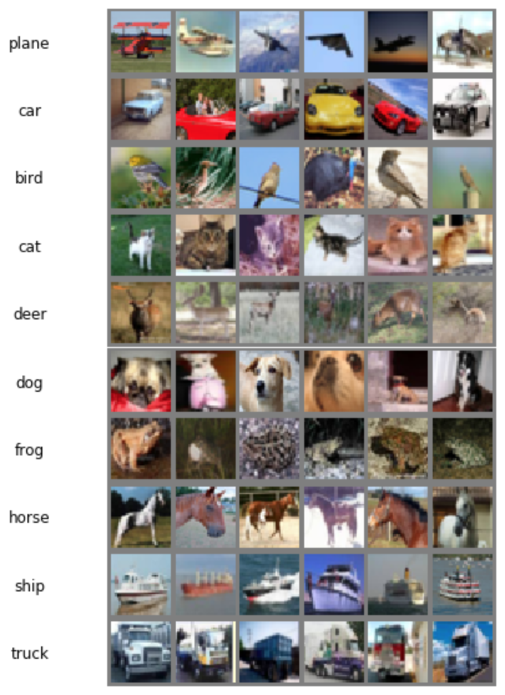

# pytorch_cnn_cifar10

### Use CNN with PyTorch to learn CIFAR-10

CIFAR-10 https://www.cs.toronto.edu/~kriz/cifar.html


### Load CIFAR10 
- using torchvision.datasets.CIFAR10
- visualized dataset

<p align="center"></p>

### Model

#### Model 1
```
CNN:
Input ->
Conv -> ReLU -> Conv -> ReLU ->MaxPool -> 
Conv -> ReLU -> Conv -> ReLU ->MaxPool -> 
Fully Connected Layer(Logits -> Softmax) -> Labels
```

#### Model 2


```
CNN:
Input ->
Conv -> ReLU -> Conv -> ReLU ->MaxPool -> 
Conv -> ReLU -> Conv -> ReLU ->MaxPool -> 
Conv -> ReLU -> Conv -> ReLU ->MaxPool -> 
Affine - ReLU - Dropout - Affine - Dropout - Softmax -> Labels
```

#### Model vgg


### Test memo:

|model|dataset size(train/test)|#epoch|  optimizer | parameters |lr| accuracy(test/train) |
|-----|-----------------------|-------|------------|------------|--|------------|
|model 1|50000/10000|25|torch.optim.Adam|Kaiming He|0.001| 69.76%/ 89.58%|
|model 2|50000/10000|25|torch.optim.Adam|Kaiming He|0.001| 70.83%/ 96.01%|
|vgg16  |50000/10000|25|torch.optim.Adam|Kaiming He|0.001| 81.01%/ 97.64%|
|vgg16  |50000/10000|50|torch.optim.Adam|Kaiming He|0.001| 83.66%/ 99.74%|
|vgg16  |50000/10000|100|torch.optim.Adam|Kaiming He|0.001->(50epoch)0.0001|83.71%/ 100.0%|
|vgg16  |50000/10000|250|torch.optim.Adam|Kaiming He|0.001->(150epoch)0.0001|84.57%/ 100.0%|

### Top 10 incorrect predicted combinations

Based on model vgg (current) result:
```
(True) ---> (Predicted)
 dog   --->   cat
 cat   --->   dog
 deer  --->  bird
 cat   --->  bird
 plane --->  bird
 dog   --->  bird
 truck --->   car
 deer  --->   cat
 bird  --->   cat
 cat   --->  frog
```